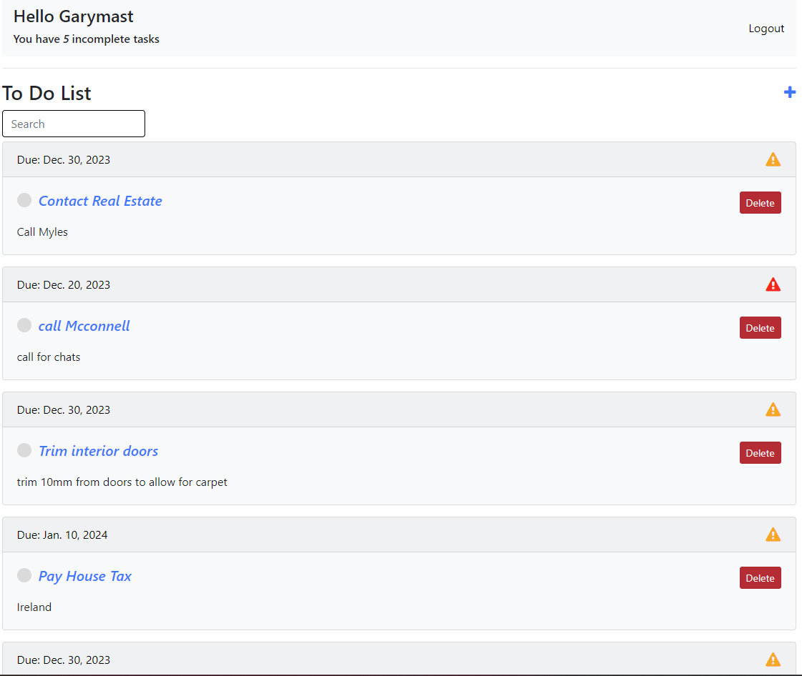

# My Tasks

You can view the live site at [OurTasks](https://django-mytasks-f5f89d77e5e0.herokuapp.com/).

My Tasks is a platform where users can manage To Do tasks in a shared online platform.

## Table of Contents

[Overview](#overview)

+ [Project Purpose](#project-purpose)

+ [Project Objectives and Outcomes](#project-objectives-and-outcomes)

+ [Target Audience](#target-audience)

[Model Views Template (mvt)](#model-views-template-mvt)

+ [Agile Terminologies](#agile-terminologies)

[Database Structure](#database-structure)

[Site Structure](#site-structure)

+ [User features and design](#user-features-and-design)

+ [Epics and user stories](#epics-and-user-stories)

+ [Authentication and Authorisation](#authentication-and-authorisation)

+ [Navigation](#navigation)

+ [Dashboard](#dashboard)

+ [Recently Added](#recently-added)

+ [Add New Spot](#add-new-spot)

+ [Edit and Delete Spot](#edit-and-delete-spot)

+ [Likes and Comments](#likes-and-comments)

+ [Report Profile and Photo](#report-profile-and-photo)

+ [List of Members](#list-of-members)

+ [User Profiles](#user-profile)

+ [Site Colours and Font](#site-colours-and-font)

[CRUD Functionality](#crud-functionality)

[Placeholders and future updates](#placeholders-and-future-updates)

[Testing](#testing)

[Deployment](#deployment)

[Technologies Used](#technologies-used)

[Resources Used](#resources-used)

[Acknowledgements](#acknowledgements)

[Retrospective](#retrospective)

## Overview

OurTasks is a platform to allow groups to add To Do items to a shared online platform. An example would be for a couple, who could add shared jobs to the platform such as paying bills, general household tasks or buying presents for an upcoming party. Another potential user group would be for a sports club, where members are usually volunteers. Members can view and add club tasks such as marking pitches, putting up nets, cleaning of facilities, purchasing of materials etc.

Currently the site being presented is a ***minimum viable product (mvp)*** - ***Phase One*** of Two phases. It is not the final platform but includes enough functionality and business logic to meet the CI project 4 purpose.

The fully deployed project can be [accessed here.](https://django-mytasks-f5f89d77e5e0.herokuapp.com/)
Use Ctrl (or Cmd) + click to open in new window

## Project Purpose

<details>

This project has been built to fit into the Code Institute project 4 criteria, the aim of which is to *build a Full-Stack web application that controls a centrally-owned dataset. An authentication mechanism should be used to provide role-based access to the site's data or other activities.*

This is the first working prototype of the final project and I will complete this platform once my course has finished. The project includes placeholders in some areas, but all aspects of the project criteria have been covered including implementing a data model, application features and business logic to manage, query and manipulate data.

The platform has been created with a strong emphasis on user experience (UX) and user interface (UI) ensuring that usability, accessibility and information architecture have not only been considered but implemented to guarantee an enjoyable user experience.

</details>

## Project Objectives and Outcomes

<details>

OurTasks is a web application made using Django. It's main aim is to provide a platform to allow groups to add To Do items to a shared online forum.

The key objectives of the project include:

+ Focusing on user centered design and providing an experience that encourages sharing and interaction through an intuitive easy to use interface.

+ Offering a dedicated space for group members to align on outstanding tasks.

+ Building a database-backed model-view-template (MVT) web application that lets users store and manipulate data records including the ability to create, read, edit and delete.

+ Giving users the ability to initiate and control their actions while providing immediate and complete feedback on data processes.

+ A place where administrators of the project have a panel that allows them to monitor members and the information they share as well as the comments they make, to ensure the community is kept safe and the environment is not abused.

The end result has been a user-friendly platform which allows users to easily manage their shared responsibilities.

</details>

<p align="right">(<a href="#table-of-content">back to top</a>)</p>

## Target Audience

<details>

The OurTasks platform has been designed for:

| Communities |
| ------------- |
| Couples or families |
| Sports clubs |
| Any community of people with common or shared responsibilities |

</details>

## Model Views Template (MVT)

<details>

I used MVT to help define the project's requirements, features, and structure by considering the following questions

**Model :**

+ What data do we need to store in the database for this network? E.g. username, password, due_date, priority, status, group
+ What are the attributes of a User profile for the members?
+ What information should be associated with a task shared by members.
+ How do we ensure that user experience is developed in a way that will enhance the effectiveness and enjoyment of the platform?

**View :**

+ What should members and non-members see when they first visit the website (homepage)?
+ How do we display the latest tasks shared by groups of members?
+ What views or pages are needed for members to register and log in?
+ How should the process to edit, add or delete tasks be structured in terms of member interactions and views?
+ What information should be displayed on a members profile page?

**Template :**

+ What should the HTML structure of the site look like? What is the layout for the pages?
+ What should the structure and design of the member registration and login forms look like?
+ What does the users template to view, add, edit and delete tasks look like? How should they be structured?
+ What should these templates include?
+ How do we ensure that both load time and responsiveness are taken into consideration when building the project?

**Authorization :**

+ How will users authentication and authorization be handled to ensure that only authorised users can add tasks?
+ Do we need to integrate any third-party services for features like email notifications?
+ How will errors and validation on user input be handled?
+ What testing strategies will be employed to ensure the system functions correctly?
+ How will user acceptance testing (UAT) be handled?

These questions lay the groundwork for creating user stories, developing the database schema, designing templates, and implementing the necessary views and functionality within Django.

</details>

## Agile Terminologies

<details>

My aim throughout this project was to focus my working time using agile terminologies:

+ Create backlog of User Stories
+ Once MVP specified, move required User Stories to To Do
+ Review work - completed yesterday, to do today, any challenges
+ Testing - developer tool, (print) command, keep an eye on terminal/console area.
+ Obtain feedback.
+ Maintain product backlog and prioritise items/adapt to change
+ Future implementations/scalability and performance optimisation.

The GitHub project area was used to manage this process.

[View my GitHub Project Board Here](https://github.com/users/garymast/projects/3/views/1)

</details>

<p align="right">(<a href="#table-of-content">back to top</a>)</p>

## Database structure

<details>

The site contains a usable database that stores data in a consistent and well-organised manner. Postresql was used to create the data structure which is hosted at ElephantSQL.

This database schema defines the structure and relationships for this application. I used business logic in the design of the database by ensuring that all required data is captured in the model.

Once users register a file is created that stores their username and password plus any additional information provided. Users are then allocated a profile and have the ability to upload tasks to the shared platform.

***Post*** includes a charField title, a charfield for content, a boolean for task status, a tuple for task priority, a DateTime field for task created, a DateField for task due date

</details>

<p align="right">(<a href="#table-of-content">back to top</a>)</p>

## Site Structure

<details>

When designing the structure of the site I kept my focus on the need to create a mobile first web-based application that has both a user interface (front end) and server-side logic database (back end) stored in a central location. My focus influenced my prototypes which are shown as wireframes below:

***Home/Index Page***

<br><br>

Register, sign in and add task pages are standard forms. The home page has an easy to navigate layout with tasks sorted by date and priority.

<br><br>

</details>

## User Features and Design

<details>

As a member of the platform, users will benefit from:

+ The opportunity to add common tasks to the groups task list.

+ An opportunity to interact with other members through comments. (Second stage)

+ A user-friendly dashboard that provides access to all parts of the platform easily.

+ A user-friendly design that works across all devices.

+ Simplicity in registering, using and interacting were the main priorities to ensure user enjoyment.

These ideas fed into the user stories.

</details>

<p align="right">(<a href="#table-of-content">back to top</a>)</p>

## EPICS and User Stories

<details>

Based on the MVT model above, the following User Stories were created to support project development.

[View my GitHub Project Board Here](https://github.com/users/garymast/projects/3/views/1)

</details>

### User Stories

<details>

A total of 8 User Stories were created to complete the first phase of the project. With 5 more being created for the second phase.

## ***Phase One:***

***Add a new task:***
+ As a **site user** I can **add a new task** so that **all my tasks are documented**

***Edit or Delete a task:***
+ As a **site user** I can **edit or delete a task** so that **I can adapt if things in my life change**

***Account Registration:***
+ As a **site user** I can **register for an account** so that **I can use the application**

***Mark a Task as Done:***
+ As a **site user** I can **easily mark a task as done** so that **I can see which tasks are complete**

***Show Task Importance:***
+ As a **site user** I can **see a flag for a tasks importance** so that **I can take care of more important tasks first**

***Date Calendar in Create Edit Form:***
+ As a **Site user** I want **select a due date in a calendar** so that **I don't have to enter a DateTime string**
  
***Add Confirmation Messages:***
+ As a **site user** I **receive confirmation messages** so that **I can be confident that I have been successful when executing tasks**

***Show Tasks By Due Date:***
+ As a **site user** I can **see the tasks in order of next due date** so that **I can attend to the urgent tasks first**

## ***Phase Two:***

***Add User Groups***
+ As a **site user** I **only want to see the To Do items for my group** so that **I do not see all users To Do tasks**

***Attach Files to Tasks***
+ As a **site user** I can **add a photo or file to a task** so that **I have a record of the relevant file**

***Dynamic Task Search***
+ As a **site user** I can **search dynamically for tasks** so that **I do not need to keep pressing enter**

***Delete My Account***
+ As a **site user** I can **delete my account** so that **I am no longer registered and my data is removed from the database**

***Send Email ALerts***
+ As a **site admin** I can **automatically send email reminders** so that **users will be alerted if they have an upcoming task deadline**

</details>

<p align="right">(<a href="#table-of-content">back to top</a>)</p>

## Authentication and Authorisation

<details>

Authorisation is only available to registered users so the site is hidden away and register details available on the homepage with a login link in the navigation bar.

In Phase One, email requirement is not necessary to become a member. Only user name and password are essential items, making registration quick and easy.

Business logic was used in the creation of the registation and log-in forms by ensuring that incoming data is validated against my business rules. e.g. users can create usernames using lowercase or uppercase text, they can log in with a username

If a new user tries to register using a username already in the system an error message will appear.

<br><br>

Once registered a new user is invited to log-in.
Their username is shown in the navbar.

Users can log-in using a username.

<br><br>


<p align="right">(<a href="#table-of-content">back to top</a>)</p>

</details>

## Navigation

<details>

A simple navigation was created using Bootstrap Navbar. Only logged-in users can see the navbar.

<br><br>

</details>

## Dashboard

<details>

New members are then taken to the shared Tasks area where they can create, view, edit or delete tasks.

<br><br>

</details>

<p align="right">(<a href="#table-of-content">back to top</a>)</p>


## Add New Task
<details>

This is a simple feature with a straightforward django form styled with Bootstrap.

<br><br>

</details>

## Edit and Delete a Task

<details>

Editing a task is done with the same form type which is used in creating a task.

Deleting a task is done with the delete button in the task list. The user is then asked to confirm they want to delete the task.

<br><br>

<br><br>

</details>

<p align="right">(<a href="#table-of-content">back to top</a>)</p>


## Mark a Task as Done

<details>

There is a circular icon which shows the tasks state. Tapping this icon will toggle the status of the task between done and not done. When a task s done, the task title has a strikethrough and the icon turns green.

<br><br>

</details>


## Site Colours and Font

<details>

I used the default bootstrap light styles for the platform. There was not a huge consideration taken here due to being an MVP.

</details>

<p align="right">(<a href="#table-of-content">back to top</a>)</p>


## Placeholders and Future Updates

<details>

Included in the [Github Project Board](https://github.com/users/garymast/projects/3) are user stories under the column "Backlog" which represents upcoming iterations. This backlog includes user stories created for an upcoming development phase.

The second phase provides an opportunity for me to respond to member feedback. It also allows for ongoing refinements and improvements that will evolve based on user input and needs. This highlights the adatability and scalability of the project.

Additional features to be included are:

+ Email Notifications - the ability to send users notifications about upcoming deadlines

+ The ability to search dynamically for tasks

+ The ability to group users

+ The ability to add files to tasks

+ The ability for the user to delete their account

</details>

<p align="right">(<a href="#table-of-content">back to top</a>)</p>

## Testing

Please see my separate [Testing MD page HERE](/TESTING.md) that includes information on testing, viability and bugs.

## Deployment

<details>

Deployment took place immediately after installing Django.
<br>

#### Installing libraries

The following steps outline all libraries needed for successful deployment on Heroku. All neccessary-requirements and settings updates will not be discussed in this section as they are assumed as logical follow-up steps to installments. For a full explanation of how to install these libraries, refer to the links provided in [Technologies Used](#technologies-used).

+ Install **Gunicorn** (server used to run Django on Heroku): ``pip3 install django gunicorn``
+ Install **pyscopg2** (connects to PostgreSQL): ``pip 3 install dj_database_url pyscopg2``
+ Install **Cloudinary** (host static files and images): ``pip3 install dj3-Cloudinary-storage``

#### Create a PostgreSQL database using ElephantSQL

This is necessary to create a database that can be accessed by Heroku. The database provided by Django can not be accessed by the deployed Heroku app.

+ Log into ElephantSQL and go to Dashboard
+ Click **Create New Instance**
+ Set up a plan by providing a Name (project name) and select a Plan (for this project the free plan "Tiny Turtle" was chosen). Tags are optional.
+ Click **Select Region** and choose appropriate Datacenter
+ Click **Review**, check all details and click **Create Instance**
+ Return to Dashboard on click on the name of the newly created instance
+ Copy the database URL from the details section

#### Hiding sensitive information

+ Create ``env.py`` file and ensure it is included in the ``.gitignore`` file
+ Add ``import os`` to env.py file and set environment variable **DATABASE_URL** to the URL copied from ElephantSQL (``os.environ["DATABASE_URL"]="<copiedURL>"``)
+ Below, set **SECRET_KEY** variable (``os.environ["SECRET_KEY"]="mysecretkey"``, but create a more secure password.)

#### Update Settings

+ Add the following code at the top of ``settings.py`` to connect the Django project to env.py:

    ````
      import os
      import dj_database_url
      if os.path.isfile('env.py'):
          import env
    ````

- Remove the insecure secret key provided by Django in settings.py and refer to a variable in env.py instead (``SECRET_KEY = os.environ.get('SECRET_KEY')``)

+ To connect to the new database, replace the provided **DATABASE** variable with

    ````
    DATABASES = {
    'default': dj_database_url.parse(os.environ.get("DATABASE_URL"))
    }
    ````

- Save and migrate all changes made


#### Allow Heroku as host

+ In ``settings.py`` add

    ````
    ALLOWED_HOSTS = ['app-name.herokuapp.com', 'localhost']
    ````

***Deploy To Heroku***

First create A Pipfile in your project terminal.

In the terminal enter the command  pip3 freeze > requirements.txt, and a file with all requirements will be created.

***Setting up Heroku***

+ Go to the Heroku website (<https://www.heroku.com/>)
+ Login to Heroku and choose Create App.
+ Click New and Create a new app.
+ Choose a name and select your location.
+ Navigate to the Deploy tab.
+ Click on Connect to Github and search for your repository.
+ Navigate to the Settings tab.
+ Reveal Config Vars and add your Cloudinary, Database URL (from ElephantSQL) and Secret key, plus PORT 8000.

***Deployment on Heroku***

+ Go to the Deploy tab.

+ For the very first deployment select manual deploy and wait as Heroku builds the logs. Once complete click on the button to view the app.

+ After the initial deployment you can then enable automatic deployment.

***DEBUG Status***

+ For the final deployment to Heroku once the project is complete and ***before*** submission of the project to Code Institute, ensure DEBUG is changed from True to ***False***.

***Fork the repository***

For creating a copy of the repository on your account and change it without affecting the original project, useFork directly from GitHub:

On [My Repository Page](https://github.com/garymast/MyTask), press Fork in the top right of the page.
A forked version of my project will appear in your repository.

***Clone the repository***

For creating a clone of the repository on your local machine, useClone:

On [My Repository Page](https://github.com/todiane/our-spot), click the Code green button, right above the code window
Chose from HTTPS, SSH and GitClub CLI format and copy (preferably HTTPS)
In your IDE open Git Bash
Enter the command git clone followed by the copied URL
Your clone was created

</details>

<p align="right">(<a href="#table-of-content">back to top</a>)</p>

## Technologies Used

<details>

Use Ctrl (or Cmd) + click to open in new window

***Core Resources:***

+ [Django](https://www.djangoproject.com/) - Framework
+ [Python](https://python.org)
+ HTML5 and CSS
+ [Bootstrap 5](https://getbootstrap.com/docs/5.0/getting-started/introduction/) - predefined responsive styles and NavBar
+ [GitHub](https://github.com/)
+ [GitHub projects](https://github.com/users/todiane/projects/8/views/1?layout=board) - managing and monitoring progress
+ JavaScript & JQuery
+ Postgresql (via ElephantSQL)

<br>

***Project Resources***

+ [ElephantSQL](https://www.elephantsql.com/)
+ [Heroku](https://heroku.com)
+ [CodeAnywhere](https://codeanywhere.com)
+ [GitPod](https://gitpod.com)
+ [Visual Studio Code](https://code.visualstudio.com/)
+ [Google Developer Tools](https://developer.chrome.com/docs/devtools/)
+ [Google Fonts](https://fonts.google.com/specimen/Mulish?query=muli)

<br>

***Libraries and Requirements***

The following libaries are included in my requirements.txt file:

+ asgiref==3.7.2
+ dj-database-url==0.5.0
+ Django=4.2.8
+ gunicorn==21.2.0
+ psycopg2==2.9.9
+ sqlparse==0.4.4
+ whitenoise==5.3.0

<br>

***Additional Resources***

+ [Font Awesome](https://www.fontawesome.com) - for icons used
+ [Diffchecker to check code](https://www.diffchecker.com/text-compare/ )

</details>

## Resources Used

<details>
This list contains resources I have used to help me start, create and manage this project.
Use Ctrl (or Cmd) + click to open in new window.
<br>

+ I think Therefore I blog Walkthrough from Code Institute

+ Hello Django Walkthrough from Code Institute

+ [Django Messaging Framework Tutorial](https://ordinarycoders.com/blog/article/django-messages-framework)

+ [Slackoverflow](https://stackoverflow.com/) for various solutions throughout the project.

+ [Django Packages](https://djangopackages.org/) to find answers from the official Django documentation.

+ [Django To Do List App](https://www.youtube.com/watch?v=llbtoQTt4qw) - helped with understanding class based views and generally improving my project

+ [Bootstrap 5 Crash Course](https://www.youtube.com/watch?v=O_9u1P5YjVc&list=PL4cUxeGkcC9joIM91nLzd_qaH_AimmdAR)

+ [Mozilla mdn web docs](https://developer.mozilla.org/en-US/docs/Learn/Server-side/Django/Testing) - for support with testing

</details>

<p align="right">(<a href="#table-of-content">back to top</a>)</p>

## Acknowledgements

+ Users who answered questions, provided images and tested the site by registering and adding images.
  
+ Slack community

<br>
<p align="right">(<a href="#table-of-content">back to top</a>)</p>

## Retrospective

<details>

A retrospective review is an important part of Agile to ensure continuous progress. We are often encouraged to add a retrospective review in our hackathon presentation, so I thought I would add one here for this project.

****What worked well for me?****
+ The initial setup was straightforward and I deployed the project early and often which prevented any major deployment issues appearing as the project progressed.

****What did not work well for me?****

+ I stuggled with the database relationships and while originally hoping to have more than one model, I ultimately kept the project as a single model.

****What actions can I take to improve my process going forward?****

+ I will do some additional study on relational databases or at least go back over the tutorials in the Code Institute tutorials.

</details>

Developer: Garymast - [GitHub](https://github.com/garymast)

<p align="right">(<a href="#table-of-content">back to top</a>)</p>
