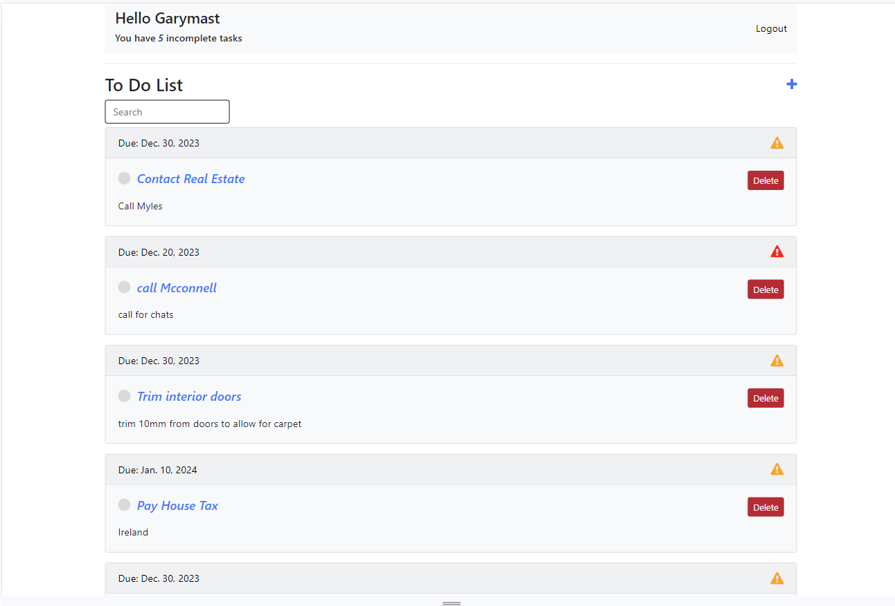
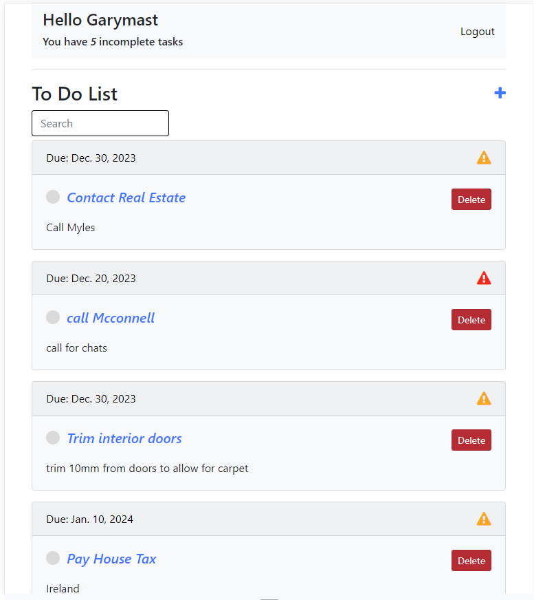
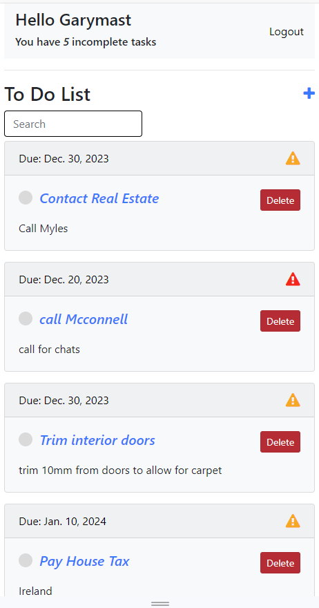
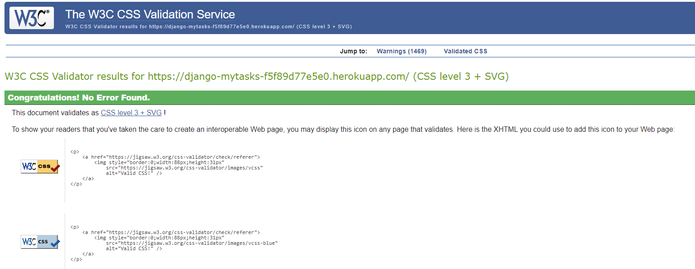
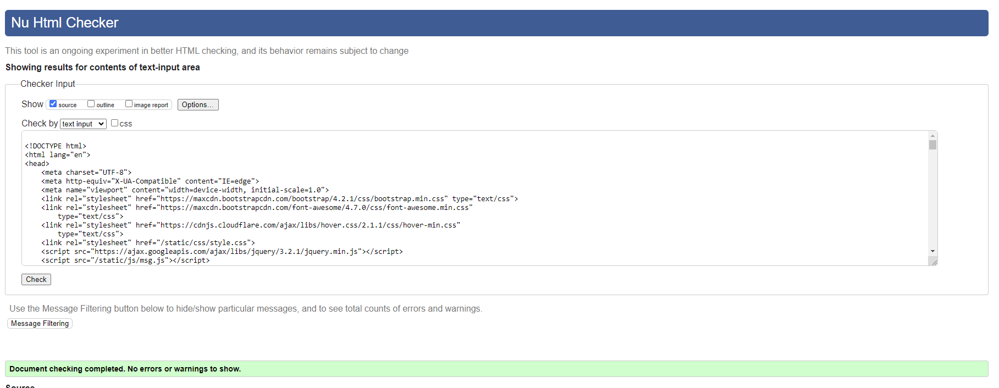
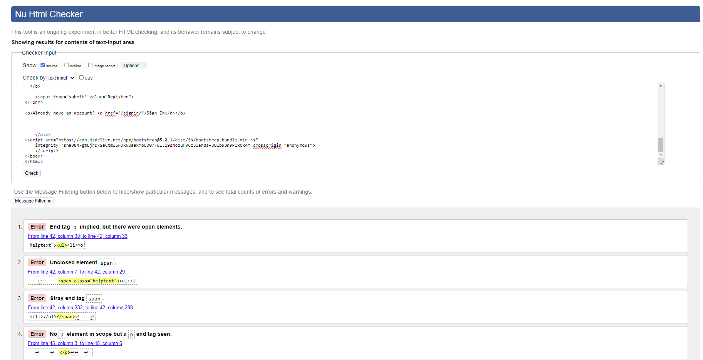
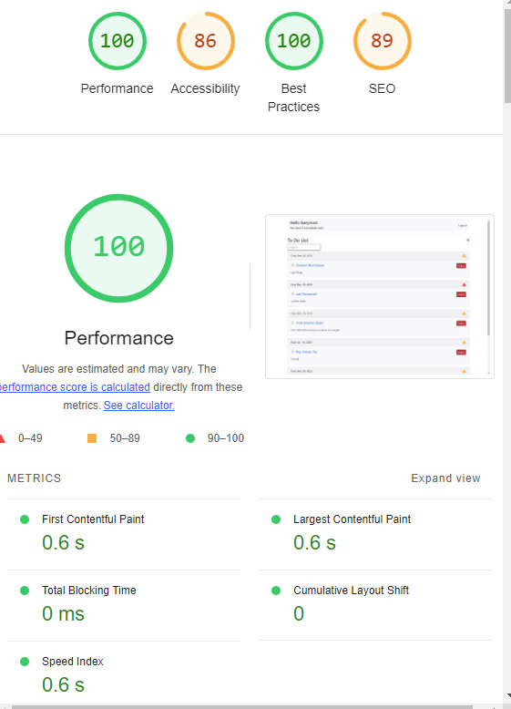

# Our Tasks

## Testing Page

Live Site is [available HERE](https://django-mytasks-f5f89d77e5e0.herokuapp.com/)

[Project Repository](https://github.com/garymast/MyTask)

[GitHub Project Table](https://github.com/users/garymast/projects/3)

Flake8 is installed and being used to ensure [PEP8 python standard](https://peps.python.org/pep-0008/#introduction)

Developer: Garymast - [GitHub](https://github.com/garymast) 

## Browser Testing

Layout: The layout and appearance of the site has been tested for consistency throughout browsers. Browers tested include the main four:

- Chrome
- Firefox
- Safari
- Microsoft Edge

Website looks and functions as intended on all browsers.

| Test | Screenshot View |
|:---|:---: |
| Laptop |    |
| Tablet |    |
| Mobile |    |

 

## Functionality Testing

I tested the complete functionality of the site. This includes:

| Test |  Action  |  Result  |
| ------------- | ------------- | ------------- |
| Validating Forms | Registration forms submitted with  a variety of correct and incorrect data | New members created and  taken to home page |
| Navbar Text and icons | Test all Navbar links  to ensure correctness of links | All links working as expected |
| Message on login | Test login with different users | Message in the home screen always shows the correct user and number of tasks  |
| Add a task | Add tasks using all options | Tasks always added with correct information regardless of which selections are made in the form  |
| Edit a task | Edit tasks using all options | Tasks always edited with correct information regardless of which selections are made in the form  |
| Delete a task | Test delete button in task list | Delete button works as expected |
| 404 and 500 pages | Test 404 and 500 pages | Not yet created |
| Stylesheet | Available sitewide | Working as expected |
| Registration | Register with different usernames Try to enter the same username twice | Registration works without issue. Usernames must be unique |
| Logout | Test logging out | Logout always works |
| Authentication | Accessing pages while not authenticated | Not possible to access pages when not authenticated
| Confirmation Messages | Test confirmation messages | Confirmation messages shown throughout the site |

***Search functionality***

Search bar in home page has been tested. The search works well to find words that begin with the specified letters. In the second phase the user will be able to search dynamically

 

## Python, CSS, JavaScript and HTML Tests

 

 

***python***

 Reformatting was performed on the python files using the code formatter [Black](https://github.com/psf/black).

 

***CSS and JavaScript Tests***

 [CSS validation service](https://jigsaw.w3.org/css-validator/) - css code validated

   

 [Black](https://github.com/psf/black) was used to remodel format in Django

 ***HTML Testing***

 All html pages were tested using the [W3C Markup Validation](https://validator.w3.org/ ) Service.

 To ensure all code was validated accurately, the 'view page source' command in Google Chrome was used as follows:

- On each page of the deployed application right-click anywhere on the page and select View Page Source.
- Copy the entire code
- Go to the validator.w3.org service and select the "validate by direct input" tab
- Paste the code into the box provided and click the CHECK button

   

I also tested each individual link (examples below) with the only issue being the HTML generated by the Django form in the register page, which I could not fix.

  

 

 

## Bugs

***Known Bugs***

- There were various bugs throughout development but there are not currently any active bugs that I could find.

## Performance and accessibility

 

 

The Lighthouse Chrome DevTools Performance test showed a 100% performance and 86% accessibility score.

  

 

## Restrospective

As the site is not too large scale, I think the amount of testing done has been sufficient. I did some usability testing with a family member and made some changes following this which was very helpful.

I hope to undertake a lot more automated testing in my next project and will place an emphasis on writing the test cases before writing functions.
